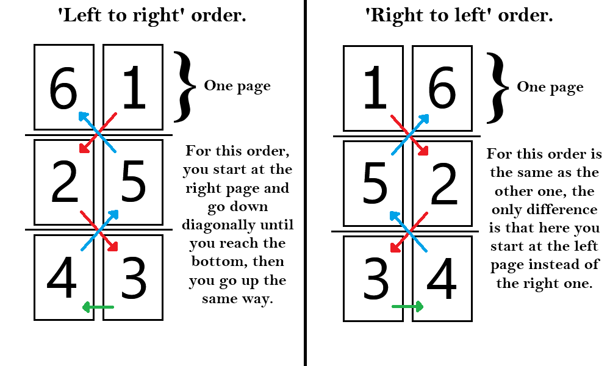

# Manga Printing Tool

Create a ready-to-print manga, book, or comic automatically from images.

## What problem does it solve?

For manga or book enthusiasts, printing their favorite titles can be a hassle. This tool simplifies the process with a straightforward approach: just place your files and double-click 'script.exe'. It handles almost everything, from splitting pages and resizing them to ensuring the print format is correct, so you don’t have to worry about the details. It also includes a basic cover creation tool, allowing you to quickly generate spines and back covers for your manga or books.

## How to download?
Go to to the [releases](https://github.com/Malagel/MangaPrintingTool/releases) tab and download the latest version. Unzip it and you are good to go.

## How to use it?

I'm assuming you already have downloaded the latest version and unzipped it somewhere, now you got many folders and a 'script.exe'.  I'm going to explain the folders later in the "steps to create your cover", since they are mostly used there. Now, let's dive into how to create your book or manga:

### **Steps to create your manga or book**

 1. You will first need to gather the pages, they need to be in '.jpg' or 'png' format, also they can be inside a '.cbz' or '.zip' or even a '.pdf', the program will extract it for you. You **need** and I repeat, you **NEED** to have a backup of your files, since they **will get modified** in the process and you won't be able to recover their original state.
 2. After you get your files and copy it to another folder as a backup, you need to put them inside the 'input' folder of where you extracted the tool. You don't need to organize the pages yourself, the program will do it for you and if it finds a problem doing so it will tell you.
 3. Double click 'script.exe' and a command line tool will appear, where you will be prompted for many *things* that I'm going to cover (there is not that small chance that windows defender blocks the program, because it modifies images and renames them, so it can be mistaken as malware. If this happens to you press 'more information' and then 'execute'. Do not worry, it's safe).
 
- ***Prompting***

Now I will explain the prompting part, basically where the program asks you *things*. The expected answers are inside the parenthesis, anything outside them will be rejected and you will be prompted again:

	 1. Do you want to print a book (manga, comic, etc) or just a cover? (cover/book):
Pretty self explanatory. The tool can create covers as well, but we will dive into that later. 

	2. Please choose paper size to print (A4, Letter, or A5): 
This is the size of the final PDF, so essentially this is the size of the paper you got in your hands. If you use bigger/smaller paper than the one you have, you will waste a **ton** of ink, and probably destroy your printer, I don't know.

    3. Delete ALL '000' pages? Usually the 000 pages are covers, artwork, fanmade, etc. (y/n):
This is just a safety measure, and it's entirely optional. Generally, when you download manga it comes with the cover named like '000.png', and of course the cover goes on the cover, therefore you don't want it to mess with you and your dreams of printing millions of books. That's why it's recommended to check your files and remove those party poopers, but if you are lazy like me just type 'y' and *maybe* it gets removed from the book.

    4. Please choose the width of the manga/book you want in centimeters (eg: 12.5) or type 'full' to cover the whole page: 
The number you have to type here is **just the width of the book** you want to create. So if you want a book of 12.5 centimeters wide, type '12.5', which is the size of most manga . This is important, because your files will get resized to match this measurement and then pasted into a PDF in pairs, so one page on the right, one on the left. 

If you've been following, you could be asking yourself "when does this end?", or maybe something more deep like "if two images will be pasted into one page, I can just divide the size of my paper by 2 and type that width!" For the first question I have no answer, but for the latter I do: you can't. Yes, you cannot do that, because the program takes into account margins, so it establishes a maximum width for each type of paper. 

Also, if you exceed certain measurements, you won't be able to create a cover page later on, since you just won't have more space in the paper. Here are my personal recommendations if you want a bigger book:

 - A4: 13.5 cm.
 - Letter: 13 cm.
 - A5: 9.5 cm.

 I can't tell you what to do though, follow your heart. 

That would be it for the tool. It can take a while to process all the images, but you can see the progress of it. Finally it will give you a file called 'output.pdf' inside the 'output' folder. Each page of the PDF will contain 2 images from your book. Remember to check it like this: 

- ***How to print your new creation***

### **Steps to create your cover**

