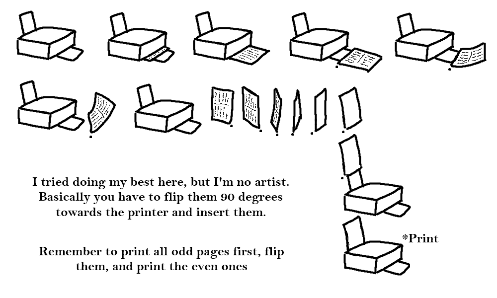

# Manga Printing Tool

Automatically Create Ready-to-Print Manga, Books, or Comics with it's covers only using easy prompts.
## What problem does it solve?

For manga or book enthusiasts, printing their favorite titles can be a hassle. This tool simplifies the process with a straightforward approach: just place your files and double-click 'script.exe'. 

It handles almost everything: splitting pages, resizing them, and ensuring the correct print format. You won’t have to worry about the details. It also includes a basic cover creation tool, allowing you to quickly generate spines and back covers for your manga or books.

## How to download?

- Go to the [releases](https://github.com/Malagel/MangaPrintingTool/releases) tab.
- Download the latest version.
- Unzip it and you are good to go.

## How to use it?

I'm assuming you already have downloaded the latest version and unzipped it somewhere, now you have many folders and a 'script.exe'.Let's dive into how to create your book or manga:

### **Steps to create your manga or book**

1. You will first need to gather the pages, they need to be in '.jpg' or 'png' format, also they can be inside a '.cbz' or '.zip' or even a '.pdf', the program will extract it for you. You **need** and I repeat, you **NEED** to have a backup of your files, since they **will get modified** in the process and you won't be able to recover their original state.

2. After you get your files and copy it to another folder as a backup, you need to put them inside the 'input' folder of where you extracted the tool.

3. Double click 'script.exe' and a command line tool will appear, where you will be prompted for many *things* that I'm going to cover (there is a not so small chance that windows defender blocks the program, because it modifies and renames images, which can mistakenly flag it as malware. If this happens to you, click 'More Information' and then 'Run Anyway').

-  ***Prompting***

Now I will explain the prompting part, basically where the program asks you *things*. The expected answers are inside the parenthesis, anything outside them will be rejected and you will be prompted again:

    1. Do you want to print a book (manga, comic, etc) or just a cover? (cover/book):
Pretty self explanatory. The tool can create covers as well, but we will dive into that later.

    2. Please choose paper size to print (A4, Letter, or A5):
This is the size of the final PDF, so essentially this is the size of the paper you got in your hands. If you use bigger/smaller paper than the one you have, you will waste a **ton** of ink, and probably destroy your printer, I don't know.

    3. Delete all '000' pages? These are typically covers, artwork, or fan-made content. (y/n):
This is just a safety measure, and it's entirely optional. Generally, when you download manga it comes with the cover named like '000.png', and of course the cover goes on the cover, therefore you don't want it to mess with you and your dreams. That's why it's recommended to check your files and remove those party poopers, but if you are lazy like me just type 'y' and *maybe* it gets removed from the book.

If you are using a PDF, it will just remove the first page (usually the cover).
 
    4. Please choose the width of the manga/book you want in centimeters (eg: 12.5) or type 'full' to cover the whole page:
The number you have to type here is **just the width of the book** you want to create. So if you want a book of 12.5 centimeters wide, type '12.5', which is the size of most manga . This is important, because your files will get resized to match this measurement and then pasted into a PDF in pairs, so one page on the right, one on the left.

The program takes into account some margins for printing, so it will limit the size you choose depending on your paper, no big book for you. Also, if you exceed certain measurements, you won't be able to create a cover page later on, since you just won't have more space in the paper. Here are my personal recommendations if you want a bigger book:

- A4: 13.5 cm.
- Letter: 13 cm.
- A5: 9.5 cm.

I can't tell you what to do though, follow your heart.

    5. Do you want to delete everything in the input folder? Useful if you want to print again or change something (y/n):
This will appear after the program finishes creating your PDF, if you won't do anything else with the program, or you want to create another book type 'y', but if you want to create a cover you would want to type 'n', since the program could still use those images to get some data (like the amount of pages of your book or it's size).

That would be it for the tool. It can take a while to process all the images, but you can see the progress of it. Finally it will give you a file called 'output.pdf' inside the 'output' folder. Each page of the PDF will contain 2 images from your book. Remember to check it like this:

  

-  ***How to print your new creation***

Now that you have your PDF ready, you need to print it for both sides of the paper. If you don't have a printer that can do that for you, the solution is printing all **odd pages** first (eg: pages number 1, 3, 5, 7...), and finally **all even pages** (eg: pages number 2, 4, 6, 8...). Normally you can select this on your printing options.

But of course, after doing your first batch of odd pages you will need to flip the paper. I made this amazing drawing to show you how to do exactly that:

  
 After printing all your pages for both sides, you will need to cut them. I'm assuming you know how to do this and even got some practice from kindergarden. Though one important thing to notice, is that the program puts your images right in the middle of the page, so the first cut you will have to do is exactly there. Then you can trim the pages however you like, and again, follow your heart.

Just after cutting your pages, you want to put them together of course, I'm no expert on crafts so we will be skipping that step, but personally I used some layers of cold glue on the spine if that helps you.

Finally, when you have your book all done, you can tell it's missing something really important, that is the cover. The one you should have removed from the printing and the one we will be using in the next section.

### **Steps to create your cover**
1. Decide what you want to do: 
- **First option:** create a cover yourself with a third party program like Photoshop. Probably the best option if you know how to do image editing.
- **Second option:** if you already have a full-cover (front, back and spine) you can put it inside the program to resize it and get it ready to print. 
- **Third option:** if you are missing any part of the full-cover, you can use this program to create the rest or all of them (really useful for mangas, because you can find a front-cover of your volume easily, and the program will handle the rest)
2. If you are still reading I'd assume you didn't choose the first option and you want to use the program to create a cover, otherwise why are you still here? We will now go over the prompting for both cases:

***Second option prompting***

First things first, for this option you **must** have the three parts, the front, back and spine. You can have them in one single image or divided in three parts: 

- For a single image that contains the whole cover you need to rename it "full_cover.png"

If you have the 3 different parts separated you will need to rename them like this:
- Front cover: named "cover.png"
- Back cover: named "back.png"
- Spine: named "spine.png"

**IMPORTANT:** the ".png" part is relevant, the program won't convert them for you if it is in another format. No reason at all, just because I'm a png supremacist.

After renaming, you would need to put everything inside the 'cover' folder, and then double click the 'script.exe' to get to the prompting:

	1. Do you want to print a book (manga, comic, etc) or just a cover? (cover/book): 
You will see this first. We want to create a cover this time, so type 'cover'.
	
	2. Choose the order in which you will be reading ('left to right' or 'right to left'): 
Same as the book creation, the program wants to know this to arrange your cover images correctly. If you got just one page this does nothing.

	3. Please choose paper size to print (A4, Letter, or A5): 
To know what kind of paper you will be using for printing, make sure that the size of your book + spine is not greater than it's size, or you would need to use a bigger one. (eg. you printed your book with a width of 13cm and letter paper, that would make the full-cover 26 cm + spine, so you need to use a bigger paper, like A4).

	# If your 'input' folder is empty:
	
	4. Please enter the height of the cover in pixels for resize/generate: 
	5. Please enter the width of the cover in pixels for resize/generate: 
	
	# If you have images inside your 'input' folder:
	
	4. The program detected images in the input folder, do you want to use them to assign the size (height and width) of the cover? (y/n): 
Here the program can detect if you got images inside the 'input' folder (the ones used to create your pdf book), and will ask you if you want your cover page to be the same size. If you don't, then you would need to know the size (width and height) in pixels of the images you used (the resized ones, not the originals) to create a cover that fits your book. 

If you are missing any of the parts, you want to use the third option:

***Third option prompting***

If you are here, you are just as lazy as me and don't want to create your own cover page everytime or you just don't feel like searching it. Either way, I'm your friend and I'm here to help you create a *decent* cover in a matter of seconds. For reference here is how a cover would look like in a PDF with just the program creation tool, no editing whatsoever:

This was entirely created with just prompts and some images you provide to the program (completely optional), here is a list of what you would need to have to get the best results possible:
- **Cover page:** more specifically a front-cover, that will be used to get colors for the missing back and spine (if you don't provide them) and will make the full-cover look a lot better. Must be named: "cover.png"
- **Image for the spine**: it could be a character image or whatever you want. It will be placed in the spine. Must be named "spine_image.png".
- **Title image**: this is an image that will be used in case you don't have a front-cover, and will be used in the back-cover. It can be whatever but I recommend a title. Must be named "title.png".
- **Editorial Image**: at the bottom of the spine you can add an editorial image. Must be named "editorial.png".
- **Font**: there is an included font, but you can change it inside the 'assets' folder. Must be named "custom_font.ttf".

Everything here but the font needs to renamed and placed inside the 'cover' folder. Another thing to note is that you can have a spine or a back and still add them, the program will generate just the missing ones (they must be named "spine.png" or "back.png").

Just after collecting everything you want to add, double click 'script.exe':

	1. Do you want to print a book (manga, comic, etc) or just a cover? (cover/book): 
We want a cover, so type 'cover'.

	2. Choose the order in which you will be reading ('left to right' or 'right to left'): 
Same as before, the program needs to know this to reverse or not the images.

	3. Please choose paper size to print (A4, Letter, or A5): 
To know what kind of paper you will be using for printing, make sure that the size of your book + spine is not greater than it's size, or you would need to use a bigger one. (eg. you printed your book with a width of 13cm and letter paper, that would make the full-cover 26 cm + spine, so you need to use a bigger paper, like A4).

	# If your 'input' folder is empty:
	
	4. Please enter the height of the cover in pixels for resize/generate: 
	5. Please enter the width of the cover in pixels for resize/generate: 
	
	# If you have images inside your 'input' folder:
	
	4. The program detected images in the input folder, do you want to use them to assign the size (height and width) of the cover? (y/n): 
Here the program can detect if you got images inside the 'input' folder (the ones used to create your pdf book), and will ask you if you want your cover page to be the same size. If you don't, then you would need to know the size (width and height) in pixels of the images you used (the resized ones, not the originals) to create a cover that fits your book. 

	5. You are missing images to create a full-cover. Do you want to create the missing ones? (y/n): 
This prompt will only appear when you are missing images (front, back or spine). Since you want to generate a missing part, we type 'y'.

	# If your 'input' folder is empty:

	6. Please enter the total number of pages, or an approximate number: 

	# If you have images inside your input folder:

	6. The program detected X pages in the input folder, do you want to use them to assign the number of pages? (y/n): 
Just like before, the program will help you if you already have images from a past book. The amount of pages is important because it will determine the width of the spine.

	7. Please enter the paper thickness in mm you will be using, or enter 'default' for an average paper thickness of 0.05: 
Here you will need to know how thick is the paper, I would recommend just typing 'default', unless your paper is a weirdo who cannot adapt to the canons of the paper society.

	8. Please enter the volume number of the manga, if it's a book use '0':
If the cover you want to create is for a manga, you would want to use a volume number, if you type '0' it won't have a number at all in the spine.

	9. Please enter the name of the manga or book for displaying (looks better with all caps for mangas and certain fonts): 
In my experience it looks better with all caps, but depends on the font you'll be using. As always, follow your heart.

	10. Please enter the author of the manga or book for displaying: 
This one doesn't look that good with all caps. Just saying.

	11. Please enter the description of the manga or book for displaying, or enter 'skip' for no description: 
You can type whatever you want here, this will be displayed on the back. You can avoid it at all by just typing 'skip'.

	12. Please enter the hex code of the front-cover color (eg. #000000), or 'default' to let the program choose.
	13. Please enter the hex code of the back-cover color (eg. #000000), or 'default' to let the program choose:  
	# And so on...
You will be prompted to give a color to the front, back, spine and font. It uses hex codes that you can choose in pages like 
[this](https://htmlcolorcodes.com/). You can also let the program choose what's best by typing 'default'.

	16. Do you want to add a QR code of this tool on the back? It will look at least OK, I promise. You can also rename de qr.png with your own image... (y/n):
This is just a QR image that is linked to this page, so it's kind of an optional ad. It looks good though.

You will now have a PDF called "cover.pdf" inside the 'output' folder. You will also have the resized parts inside the 'cover' folder, so if you want to change something of them you can alter those instead of creating your own.

	